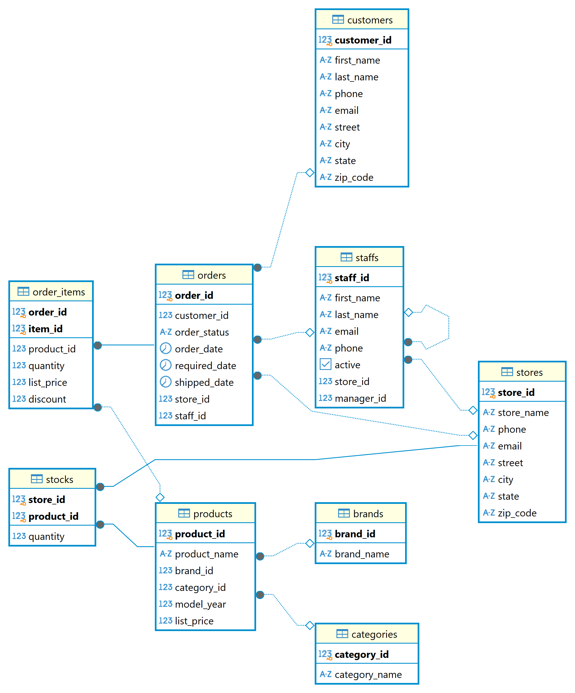

# E-commerce Data Analysis

## Overview

This project encompasses a comprehensive analysis of various business metrics and performance indicators across different areas, utilizing SQL queries to extract and calculate meaningful insights. The key focus areas include:

1. **Customer Analysis**: SQL script analyzes customer behavior and spending patterns using various aggregation functions.

2. **Discount & Sales Analysis**: Analysis of sales with and without discounts, average discounts per order, and revenue generation by product and category.
2. **Feature & Product Analysis**: Exploration of customer demographics, product categories, and store performance.
3. **KPI Analysis**: Calculation of key metrics such as total sales, order quantity, and average price, aimed at evaluating overall business health.
4. **Product & Inventory Analysis**: Tracking best-selling products, stock turnover ratios, and product trends over time.
5. **RFM (Recency, Frequency, Monetary) Analysis**: Customer segmentation based on purchase behavior, identifying new, lost, regular, loyal, and champion customers.
6. **Sales & Performance Trends**: Year-over-year performance analysis, sales trends across months and weekdays/weekends, and analysis of sales performance for stores, products, and brands.
7. **Staff & Store Performance**: Metrics for evaluating staff performance in terms of sales contribution, order handling, and managerial effectiveness. Also, evaluation of store performance based on sales, customer count, delivery times, and cancellation rates.
8. **Year-over-Year Performance**: Detailed comparison of year-on-year performance with growth percentage and trend analysis.

The project aims to provide actionable insights into sales, product performance, customer behavior, store efficiency, and staff productivity, ultimately contributing to better decision-making and strategic planning for business growth.

## Features

- Predefined SQL queries to fetch important data
- ER diagram to visualize the database schema

## Database Schema

The database schema is designed to store and manage data efficiently. Below is the ER diagram that illustrates the relationships between different entities:



## Queries

Queries and its details:

### customerAnalysis.sql
The SQL queries analyze customer behavior by identifying frequent customers, top spenders, and distinguishing new vs. repeat customers. It helps track customer engagement, spending patterns, and retention trends. 🚀

### databaseInit.sql
The SQL script creates a DataAnalysis database with a sales schema and defines tables for customers, stores, staff, orders, products, and inventory, with appropriate foreign key relationships. It then loads data from CSV files into these tables and runs queries to fetch customer and store details and list store table columns.

### databaseInformation.sql
The script explores the database structure by retrieving a list of all tables and inspecting column details for the customers and orders tables using the INFORMATION_SCHEMA views.

### dateExploration.sql
The script analyzes order date ranges, shipping durations, and delivery times. It calculates the first and last order dates, minimum delivery time for completed orders, average delivery time per store, and the distribution of order statuses.

### discount.sql
The script analyzes the impact of discounts on sales by comparing total revenue from discounted vs. non-discounted sales. It also calculates the average discount percentage per order.


### featureAnalysis.sql
The script analyzes dimension tables by retrieving unique cities, states, store names, brands, categories, and product names. It also lists customer names and identifies high-density customer areas based on zip codes.

### indexing.sql
The script focuses on query optimization by using `EXPLAIN` and `EXPLAIN ANALYZE` to analyze execution plans, creating an index on `order_date` for faster searches, and implementing table partitioning to improve query performance on `orders`.

### KPIanalysis.sql
The script performs KPI analysis by calculating key business metrics such as total orders, customers, products, brands, categories, items sold, average selling price, average order value, and total revenue. It also generates a summarized report of these metrics.

### productAndInventory.sql
The script analyzes product and inventory performance by identifying the **top-selling products**, calculating the **stock turnover ratio**, and tracking **monthly and yearly sales trends** of products.

### RFManalysis.sql
The script performs **RFM (Recency, Frequency, Monetary) analysis** to segment customers based on their purchase behavior. It categorizes customers into **New, Lost, Regular, Loyal, and Champion Customers** based on how recently they purchased, how often they buy, and how much they spend.

### salesAnalysis.sql
The script performs **Sales Analysis** by calculating various sales metrics including **selling price per order item**, **total revenue per product**, **weekly and monthly sales trends**, **weekday vs weekend sales**, and **sales by category and brand**. It also computes **running total sales** and **moving average price** over time.

### staffPerformance.sql
The script analyzes **staff performance** by calculating key metrics such as **sales contribution per staff**, **orders handled by each staff**, and **sales performance of managers**. It identifies top-performing staff based on total sales, counts the number of orders handled, and evaluates managers based on the total sales of their teams.

### storePerformance.sql
This script focuses on **store performance analysis** by calculating various key metrics:

1. **Revenue per store**: The total sales for each store, considering the quantity sold and discounts.
2. **Number of unique customers per store**: The distinct count of customers who made purchases at each store.
3. **Store with the quickest delivery time**: The store with the shortest delivery duration for orders marked as completed.
4. **Average delivery time**: The average time taken from order to shipment.
5. **Order cancellation rate**: The percentage of orders that were canceled.
6. **On-time delivery rate**: The percentage of orders that were shipped on or before the required date.

### subtotal.sql
This query calculates the **sales performance** of each store by year and month. It shows total sales for each store, broken down by month and year, using the `ROLLUP` function to include subtotals and a grand total. The result includes the store name, year, month, and total sales, ordered by store, year, and month.

### YOYperformance.sql
This query performs a **Year-over-Year (YoY) performance analysis**, comparing sales for each year. It calculates the total sales for each year, compares it with the previous year's sales using the `LAG()` function, and computes the YoY growth percentage. It also categorizes the sales trend as either "Increase" or "Decrease" based on the growth between years. The results are ordered by year.

## Installation

To use this project, follow these steps:

1. Clone the repository:
   ```bash
   git clone https://github.com/ithilaka/SQL-Data-Analysis.git
   ```
2. Import the SQL scripts into your database.
3. Run the queries as needed.

## Requirements

- Database Management System (PostgreSQL)
- SQL client to execute queries

## License
MIT License


